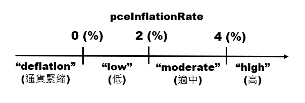
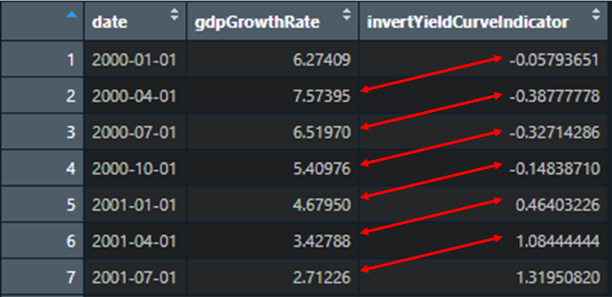

```{r setup, include=FALSE}
knitr::opts_chunk$set(echo = TRUE)
```


# Macroeconomics Data

> The Fed has aggressively raising the Federal Funds Target Rate frequently in 2022, due to severe inflation condition.


## Import Data

> We import data from FRED economic database, a database that includes a variety of US macroeconomic data. The data we use are all based on **quarterly** frequency.

```{r}
library(readr)

# Effective Federal Funds Rate
federalFundsRate <- read_csv("macrodata/Federal Funds Rate.csv")
dplyr::glimpse(federalFundsRate)

# PCE Inflation
pceInflationRate <- read_csv("macrodata/PCE Inflation Rate.csv")
dplyr::glimpse(pceInflationRate)
library(magrittr)
library(lubridate)
pceInflationRate$DATE %<>% lubridate::ymd()
dplyr::glimpse(pceInflationRate)

# GDP Growth Rate
gdpGrowthRate <- read_csv("macrodata/GDP Growth Rate.csv")
dplyr::glimpse(gdpGrowthRate)

# Unemployment Rate
unemploymentRate <- read_csv("macrodata/Unemployment Rate.csv")
dplyr::glimpse(gdpGrowthRate)

# 10-Year Treasury Constant Maturity Minus 2-Year Treasury Constant Maturity
invertYieldCurveIndicator <- read_csv("macrodata/Invert Yield Curve Indicator.csv")

# Merge All Above
library("tidyverse")
library("magrittr")
list(federalFundsRate, pceInflationRate, gdpGrowthRate, unemploymentRate, invertYieldCurveIndicator) %>% reduce(full_join, by="DATE") -> mergedMacroData

View(mergedMacroData)
dplyr::glimpse(invertYieldCurveIndicator)
```

```{r}
# log 
ourFinalProject = list()
ourFinalProject$data$federalFundsRate = list(
  value=federalFundsRate,
  description="federalFundsRate",
  source="https://fred.stlouisfed.org/series/DFF#0"
)
ourFinalProject$data$pceInflationRate = list(
  value=pceInflationRate,
  description="pceInflationRate",
  source="https://fred.stlouisfed.org/series/PCEPI#0"
)
ourFinalProject$data$gdpGrowthRate = list(
  value=gdpGrowthRate,
  description="gdpGrowthRate",
  source="https://fred.stlouisfed.org/series/GDP#0"
)
ourFinalProject$data$unemploymentRate = list(
  value=unemploymentRate,
  description="unemploymentRate",
  source="https://fred.stlouisfed.org/series/UNRATE#0"
)
ourFinalProject$data$invertYieldCurveIndicator = list(
  value=invertYieldCurveIndicator,
  description="invertYieldCurveIndicator",
  source="https://fred.stlouisfed.org/series/T10Y2Y#0"
)
ourFinalProject$data$mergedMacroData = list(
  value=mergedMacroData,
  description="mergedMacroData"
)
```


## Checking


### Hawks ? Doves ?

> Instead of the exact Effective Federal Funds Rate, we're more interested in Fed's monetary policy direction. Is it expansionary or contractionary ?

> If the quarterly average Effective Federal Funds Rate is higher than previous quarter, then we define it as a rate-hiking monetary policy. On the contrary, we define it as a rate-cutting monetary policy.

```{r}
monetaryPolicy = data.frame()
monetaryPolicy[1,1] = NA
for (.x in c(2:91)) {
  ifelse(mergedMacroData[.x, 2] > 
         mergedMacroData[.x-1, 2], 
         "rateHike","rateCut") -> 
  monetaryPolicy[.x, 1]
}
colnames(monetaryPolicy) <- "monetaryPolicy"

federalFundsRate[,3] <- monetaryPolicy

# merge again
library("tidyverse")
library("magrittr")
list(federalFundsRate, pceInflationRate, gdpGrowthRate, unemploymentRate, invertYieldCurveIndicator) %>% reduce(full_join, by="DATE") -> mergedMacroData
```


### The degree of inflation

> The avereage level of inflation is about 2%.

> The maximum of inflation can be three times higher than average, and inflation can be even negative, which a phenomenon known as "deflation" is likely to occur.

```{r}
mean(pceInflationRate$PCEPI_PC1)
median(pceInflationRate$PCEPI_PC1)
range(pceInflationRate$PCEPI_PC1)
```

> Is inflation high now ? What kind of level of inflation will be regarded as "high" ?

> We define in "high" = inflation higher than 4(%), "moderate" = inflation between 2(%)~4(%), "low" = inflation between 0(%)~2(%), "deflation" = negative inflation.

```{r}
data.frame(
  inflationIndicator = 
  ifelse(pceInflationRate$PCEPI_PC1 > 4, "high", 
  ifelse(pceInflationRate$PCEPI_PC1 > 2, "moderate", 
  ifelse(pceInflationRate$PCEPI_PC1 > 0, "low", "deflation")))
) -> inflationIndicator

pceInflationRate[,3] <- inflationIndicator

# merge again
library("tidyverse")
library("magrittr")
list(federalFundsRate, pceInflationRate, gdpGrowthRate, unemploymentRate, invertYieldCurveIndicator) %>% reduce(full_join, by="DATE") -> mergedMacroData
```

```{r}

```


### Invert yield curve indicator

> When "invertYieldCurveIndicator" is negative, which means that the yield curve is currently invert, it usually stands for a prediction that the economy might go in to a recession soon.

> We want to create an additional column that shows whether the yield curve is invert or not.

```{r}
dfInvertOrNot = data.frame(invertOrNot = ifelse(invertYieldCurveIndicator$T10Y2Y <= 0, "TRUE", "FALSE"))

invertYieldCurveIndicator[,3] <- dfInvertOrNot

# merge again
library("tidyverse")
library("magrittr")
list(federalFundsRate, pceInflationRate, gdpGrowthRate, unemploymentRate, invertYieldCurveIndicator) %>% reduce(full_join, by="DATE") -> mergedMacroData
```

```{r}
View(federalFundsRate)
View(pceInflationRate)
View(invertYieldCurveIndicator)
```


### Rename features and class fix

```{r}
mergedMacroData |> names() <-
  c("date", "federalFundsRate", "monetaryPolicy", 
    "pceInflationRate", "inflationIndicator", 
    "gdpGrowthRate", "unemploymentRate", 
    "invertYieldCurveIndicator", "invertOrNot")

# Creating class positions.
datePosition = c(1)
numericPosition = c(2,4,6:8)
factorPosition = c(3,5,9)

# date class
datePosition = c(1)
mergedMacroData[[datePosition]] %<>% lubridate::ymd()

# numeric class
numericPosition = c(2,4,6:8)
mergedMacroData[[numericPosition[[1]]]] %<>% as.numeric()
mergedMacroData[[numericPosition[[2]]]] %<>% as.numeric()
mergedMacroData[[numericPosition[[3]]]] %<>% as.numeric()
mergedMacroData[[numericPosition[[4]]]] %<>% as.numeric()
mergedMacroData[[numericPosition[[5]]]] %<>% as.numeric()

# factor calss
factorPosition = c(3,5,9)
mergedMacroData[[factorPosition[[1]]]] %<>% factor()
mergedMacroData[[factorPosition[[3]]]] %<>% factor()

# "inflationIndicator" is a special one, since it should be an ordered factor, we want to carefully parse it step by step.
factor(
  mergedMacroData$inflationIndicator, 
  levels = c("deflation", "low", "moderate", "high"), 
  ordered = T) -> mergedMacroData$inflationIndicator
```

```{r}
# log 
ourFinalProject = list()
ourFinalProject$data$federalFundsRate = list(
  value=federalFundsRate,
  description="federalFundsRate",
  source="https://fred.stlouisfed.org/series/DFF#0"
)
ourFinalProject$data$pceInflationRate = list(
  value=pceInflationRate,
  description="pceInflationRate",
  source="https://fred.stlouisfed.org/series/PCEPI#0"
)
ourFinalProject$data$gdpGrowthRate = list(
  value=gdpGrowthRate,
  description="gdpGrowthRate",
  source="https://fred.stlouisfed.org/series/GDP#0"
)
ourFinalProject$data$unemploymentRate = list(
  value=unemploymentRate,
  description="unemploymentRate",
  source="https://fred.stlouisfed.org/series/UNRATE#0"
)
ourFinalProject$data$invertYieldCurveIndicator = list(
  value=invertYieldCurveIndicator,
  description="invertYieldCurveIndicator",
  source="https://fred.stlouisfed.org/series/T10Y2Y#0"
)
ourFinalProject$data$mergedMacroData = list(
  value=mergedMacroData,
  description="mergedMacroData"
)
```


## Description

> Before we start, we created several catagorical features for the upcoming analysis. Then we rename columns to English. A thorough class check was done as well, wrong classes have been fixed.


### Data source

> We import data from FRED economic database, a database that includes a variety of US macroeconomic data. The data we use are all based on **quarterly** frequency. 

> Each data entity is a set of various macroeconomic variables(一系列的總體經濟變數).

```{r}
ourFinalProject$data$federalFundsRate$source |> browseURL()
ourFinalProject$data$pceInflationRate$source |> browseURL()
ourFinalProject$data$gdpGrowthRate$source |> browseURL()
ourFinalProject$data$unemploymentRate$source |> browseURL()
ourFinalProject$data$invertYieldCurveIndicator$source |> browseURL()
```


### Data entity

> The data consists totaly 91 observations with 9 features
> One of the features is time series, three of the features are derivative catagorical oservations from economic variables, and the other five features are economic variables.

```{r}
ourFinalProject$data$mergedMacroData$value |> dplyr::glimpse()
```

> Show the time series feature
> The data ranges from 2000 Q1 to 2022 Q3, which includes 91 quarters.

```{r}
ourFinalProject$data$mergedMacroData$value[,1] |> unique()
```

> Show the derivative catagorical features

```{r}
colnames(ourFinalProject$data$mergedMacroData$value)[factorPosition]
```

> Show the economic variable features

```{r}
colnames(ourFinalProject$data$mergedMacroData$value)[numericPosition]
```

> For one example, the following programing shows the macroeconomic data values under specific time **2000 year, quarter2**.

```{r}
ourFinalProject$data$mergedMacroData$value[2,]
```

> Short summary: The data covers 5 economic variables and 2 catagorical discussion, from 2000 Q1 to 2022 Q3, with total observations of 91 and 9 features.


## Summary


### Is NA Summary

> Is there any NAs in our data ?

```{r}
anyNA(mergedMacroData)
```

> Yes, there is.

> Form the "naSummary".

```{r}
isNaMat = is.na(mergedMacroData)
naSummary = list()
for(.x in colnames(mergedMacroData)){
  isNaMat[, .x] |> table() -> naSummary[[.x]]
}
View(naSummary)
```

> The only one NA is in "monetaryPolicy", which is intentionally created by us, so it doesn't matter. The NA check is completed.


### Catagorical summary

> Summarize all catagorical features.

```{r}
catagoricalSummary = list()
for (.x in colnames(mergedMacroData)[factorPosition]) {
  mergedMacroData[[.x]] |> table() |> prop.table() -> 
  catagoricalSummary[[.x]]
}
View(catagoricalSummary)
```

> Summarize "monetaryPolicy" feature

```{r}
mergedMacroData$monetaryPolicy |> levels()
mergedMacroData$monetaryPolicy |> table() |> prop.table()
# The outcome is approximately both half-and-half.

# Shown in figure below.
library(tidyverse)
barplot(
  table(mergedMacroData$monetaryPolicy),
  space = T, xlab = "monetary policy"
)
```

> Summarize "inflationIndicator" feature

```{r}
mergedMacroData$inflationIndicator |> levels()
mergedMacroData$inflationIndicator |> table() |> prop.table()
# Not many outliers, most of the time inflation is at a low or moderate level.

# Shown in figure below.
library(tidyverse)
barplot(
  table(mergedMacroData$inflationIndicator),
  space = T, xlab = "inflation indicator"
)
```

> Summarize "invertOrNot" feature

```{r}
mergedMacroData$invertOrNot |> levels()
mergedMacroData$invertOrNot |> table() |> prop.table()
# An invert yield curve is relatively rare, but when it happens, there's usually bad news.

# Shown in figure below.
library(tidyverse)
barplot(
  table(mergedMacroData$invertOrNot),
  space = T, xlab = "invert or not"
)
```


### Numeric summary

> Summarize all numeric features.

```{r}
numericSummary = list()
for(.x in colnames(mergedMacroData)[numericPosition]){
  numericSummary[[.x]] <- list(
  "mean" = mergedMacroData[[.x]] |> mean(na.rm=T),
  "median" = mergedMacroData[[.x]] |> median(na.rm=T),
  "range" = mergedMacroData[[.x]] |> range(na.rm=T),
  "var" = mergedMacroData[[.x]] |> var(na.rm=T)
  )
}
View(numericSummary)
```

#### Box plot

```{r}
# Box plot illustrates the numeric summary in graphic.
for (.x in colnames(mergedMacroData[numericPosition])) {
  boxplot(mergedMacroData[, .x],
          range = 1.5, horizontal = T, main = .x)
}
```

#### Density plot (distribution)

```{r}
# Observe the distribution of each variable.
for (.x in colnames(mergedMacroData[numericPosition])) {
  library(tidyverse)
  plot(density(mergedMacroData[[.x]]), main = .x)
}
```
> The distribution of federal funds rate has a positive (right) skew.
> The distribution of inflation has a shape similar to a bell curve.
> The distribution of GDP growth rate is intensive, which refers to a high kurtosis.
> The distribution of unemployment rate has a positive (right) skew.
> The distribution of invert indicator tells that it's usually positive, which implies that the yield curve usually slopes upward.

#### Time series plot

```{r}
# Time series plot enables us to observe the fluctuation.
for (.x in c("federalFundsRate", "pceInflationRate", "gdpGrowthRate", "unemploymentRate")) {
  plot.ts(ts(data = mergedMacroData[, .x],
           start = 2000-01-01, frequency = 4),
        main = .x)
}
```

```{r}
plot.ts(ts(data = mergedMacroData[, "invertYieldCurveIndicator"],
           start = 2000-01-01, frequency = 4),
           main = "invertYieldCurveIndicator") +
abline(h = 0, col = "red")
```


## Exploration


### How is Fed's monetary policy decision affected by inflation level ?

> We know that Fed, as the centeral bank of United States, mainly has two policy goals -- maintain price stability & promote economic growth. 

> Unfortunately, Fed usually faces a tardeoff between these two goals. Some say that the price stability is the priority.

> We try to conduct a logical test. 

```{r}
inflationIndicator == "moderate" | inflationIndicator == "high" ->
  inflationPickVector
monetaryPolicy == "rateHike" -> monetaryPolicyPickVector

ifelse(inflationPickVector == monetaryPolicyPickVector, T, F) ->
  comparison

colnames(comparison) <- "comparison"

cbind(inflationPickVector, 
      monetaryPolicyPickVector, 
      comparison) -> inflationPolicyRelation

inflationPolicyRelation[,"comparison"] |> table() |> prop.table()
```


### Finding the Phillips Curve.

> The Phillips Curve represents the tradeoff relationship between inflation and unemployment.

> We want to prove this negative relationship through empirical methods.

```{r}
cor(
  mergedMacroData[,"pceInflationRate"], 
  mergedMacroData[,"unemploymentRate"]
  )
```

> Plot inflation against unemployment.

```{r}
library(tidyverse)
ggplot(data = mergedMacroData[,c("pceInflationRate", "unemploymentRate")],
      mapping = aes(x = unemploymentRate, y = pceInflationRate))+
geom_point(size = 5)+
geom_smooth(method = lm, se = F)
```


### Identify the Okun's law

> The Okun's law represents the negative relationship between output and unemployment.

```{r}
knitr::include_graphics("./Okun's law formula.PNG")
```

> We want to prove this negative relationship through empirical methods.

```{r}
cor(
  mergedMacroData[,"gdpGrowthRate"], 
  mergedMacroData[,"unemploymentRate"]
  )
```

> Plot economic growth rate against unemployment.

```{r}
library(tidyverse)
ggplot(data = mergedMacroData[,c("gdpGrowthRate", "unemploymentRate")],
      mapping = aes(x = unemploymentRate, 
                    y = gdpGrowthRate))+
geom_point(size = 5)+
geom_smooth(method = lm, se = F)
```


### How long does it take for "invert yeild curve effect" to hit ?

> If in difference between 10-Year treasury constant maturity and 2-Year treasury constant maturity narrows, investors expects the future economic growth to soften.

> Suppose the invert yeild curve indicator affects economic growth a few quarters later.

> The lag of "invert yeild curve effect" takes about two years.

```{r}
# If the lag quarters = 1

```


```{r}
lagQuarters = c(1:20)
invertEffectAnalysis = c()
for (.x in lagQuarters){
  invertEffectAnalysis[[paste(.x)]] = 
  cor(
  mergedMacroData[c((1+ .x):91), "gdpGrowthRate"], 
  mergedMacroData[c(1:(91- .x)), "invertYieldCurveIndicator"]
  ) 
}

invertEffectAnalysis %<>% data.frame()
invertEffectAnalysis %<>% t()
colnames(invertEffectAnalysis) <- "correlation"
row.names(invertEffectAnalysis) <- lagQuarters
invertEffectAnalysis %<>% data.frame()

library(tidyverse)
ggplot(data = invertEffectAnalysis,
       mapping = aes(x = lagQuarters,
                     y = correlation)) + 
  geom_point(size = 5) +
  xlab("lag quarters")
```


## Conclusion

> Inflation is an explanatory variable for Fed's monetary policy decision, but there's still many other factors.

> The Phillips Curve can be demonstrated. 

> The Okun's law still holds, but some empirical studies have shown that the Okun coefficient might has changed over time.

> Whether the yeild curve invert or not will surely affect the economic growth rate, but the effect comes with a lag about two years.


## Saving results

```{r}
saveRDS(ourFinalProject, file = "ourFinalProject.Rds")
```

```{r}
ourFinalProject = readRDS("ourFinalProject.Rds")
ourFinalProject$data$federalFundsRate$value -> federalFundsRate
ourFinalProject$data$pceInflationRate$value -> pceInflationRate
ourFinalProject$data$gdpGrowthRate$value -> gdpGrowthRate
ourFinalProject$data$unemploymentRate$value -> unemploymentRate
ourFinalProject$data$invertYieldCurveIndicator$value -> invertYieldCurveIndicator
ourFinalProject$data$mergedMacroData$value -> mergedMacroData
```
